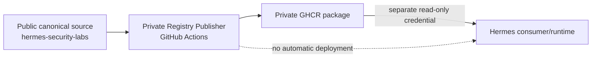
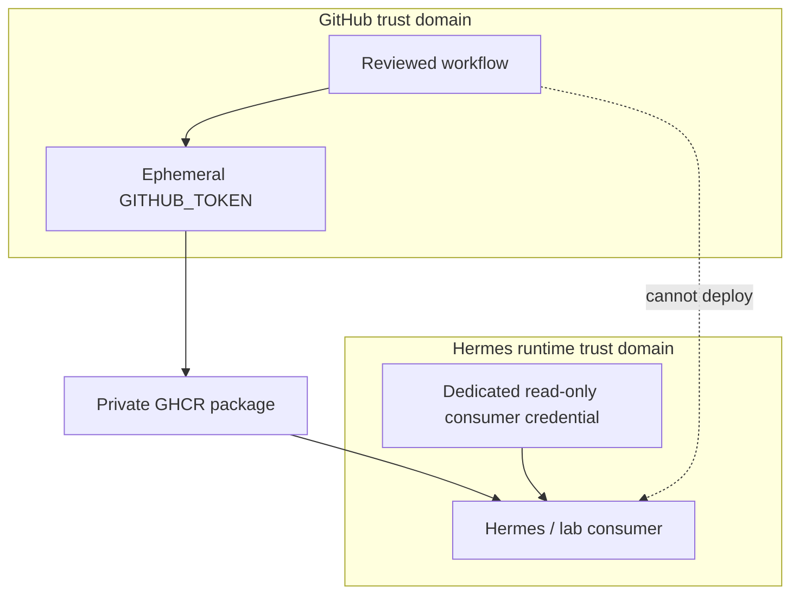
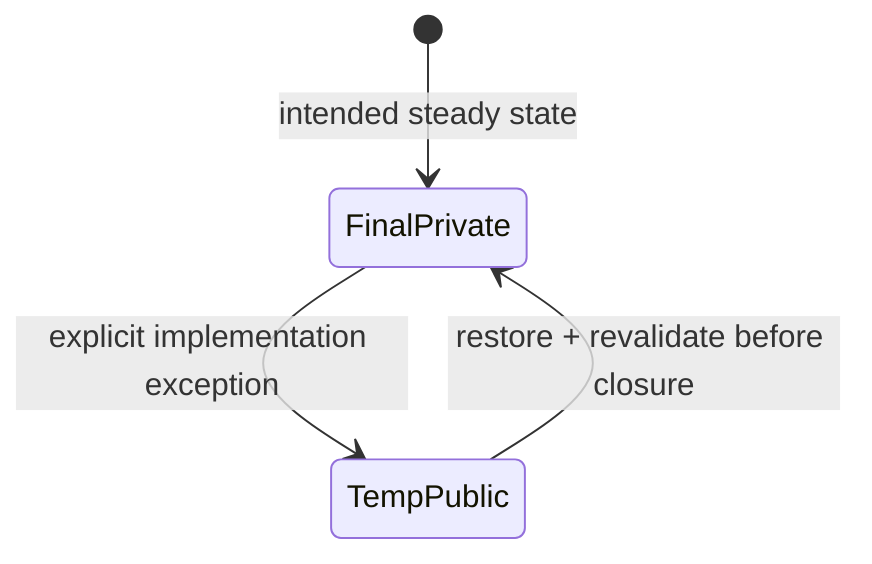
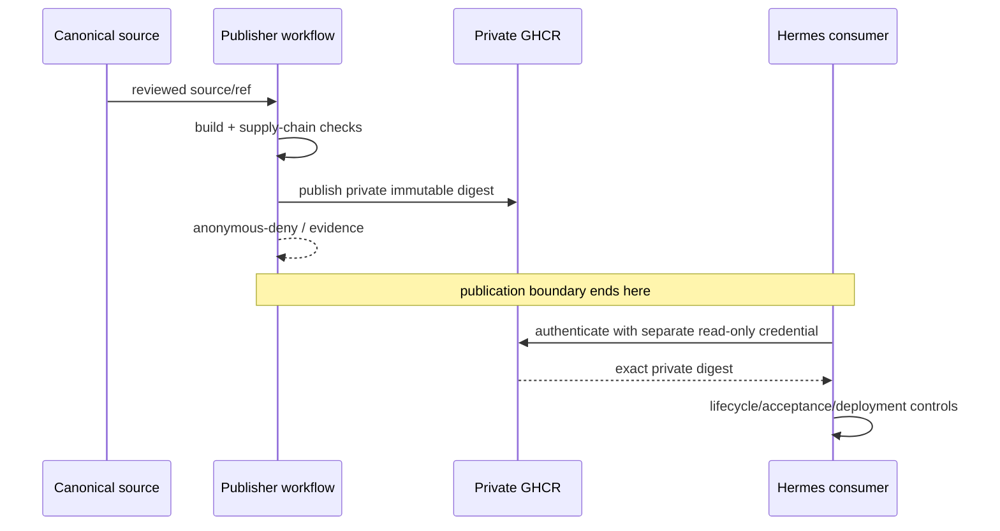

# Hermes Private Registry Publisher

> A deliberately narrow GitHub Actions publication boundary for building reviewed private GHCR packages consumed by Hermes. **It publishes artifacts; it does not deploy them.**

## Current state

**Reviewed 2026-08-09.**

- the VAmPI private-publication pilot has successfully produced a private GHCR package;
- publication workflow, SBOM/provenance and anonymous-deny controls exist;
- the repository is **currently public under an explicitly temporary implementation exception**;
- the accepted final operating state requires this repository to be **private** again;
- the `hermes-private-vampi` package must remain **private throughout**;
- Hermes runtime pull/deployment is a separate consumer-side acceptance boundary.

## Why this repository exists

The canonical lab source can remain public while a separate trust boundary owns **private package publication**. This avoids granting the source repository or runtime broader registry permissions than they require.

## Security boundary

| Concern | Boundary |
|---|---|
| Canonical source | `pestoura/hermes-security-labs` |
| Publisher | this repository / GitHub-hosted Actions |
| Publication credential | ephemeral repository `GITHUB_TOKEN` |
| Artifact | private `ghcr.io/pestoura/hermes-private-vampi` |
| Runtime consumer credential | separate credential, exactly scoped for package read where possible |
| Deployment | outside this repository |
| Docker socket on Hermes | not used by publisher workflows |
| Reusable registry credential in Git | forbidden |

## Verified pilot evidence

The private VAmPI publication pilot has executed successfully:

| Evidence | Value |
|---|---|
| Publisher workflow | `.github/workflows/publish-private-vampi.yml` |
| Owner-triggered publication run | `30680647184` |
| Result | `SUCCESS` |
| Publisher commit | `1ce1b1c72c20cf9267fbdc460f40fcfe1d310d08` |
| Private VAmPI OCI index | `sha256:b1b66324a2d35cfe55e3edcd81f9f3c012907c71367df37f83d9ef63b500b3d3` |
| SBOM / BuildKit provenance | enabled by accepted publication workflow |
| Publisher-driven Hermes deployment | **not performed** |

An independent workflow also verifies that anonymous access to the exact private digest is denied for authentication/authorization reasons.

## Temporary repository-visibility exception

The final design requires a private publisher repository. The repository is currently public only because GitHub-hosted Actions were blocked for this account while it was private and an owner-approved implementation exception was granted.

The exception permits repository visibility to be temporarily public; it does **not** permit:

- making `hermes-private-vampi` public;
- granting the public canonical source package access;
- storing a PAT or Docker auth material in the repository;
- using this public repository as the runtime credential boundary;
- treating temporary public visibility as the accepted final state.

## What this repository does

- builds/publishes the reviewed private VAmPI package through GitHub Actions;
- emits supply-chain evidence such as SBOM/provenance;
- verifies anonymous private-package denial;
- provides controlled consumer and rollback preflight workflows;
- documents the publisher trust boundary and pilot.

## What this repository does **not** do

- deploy packages to Hermes;
- own the canonical VAmPI source;
- store the Hermes runtime pull credential;
- grant broad package administration to the consumer;
- expose the Hermes Docker socket to GitHub-hosted Actions;
- prove that a package is safely usable in the runtime merely because publication succeeded.

## Publication vs consumption sequence

## Remaining operational gate

The remaining path is consumer/deployment acceptance plus restoration of the final repository boundary:

1. provision a distinct Hermes package-read credential outside Git and outside this publisher workflow;
2. prove exact-digest private pull;
3. prove absence of unnecessary push/delete authority without mutating package state;
4. run temporary private VAmPI lifecycle parity;
5. review/merge the separate runtime Compose migration;
6. perform exact-SHA post-merge acceptance and rollback proof;
7. reconcile deployment tracking/drift detection;
8. restore this publisher repository to **private**;
9. revalidate final package/repository access boundaries before closure.

The canonical transition specification and tracking remain owned by `hermes-security-labs` (`docs/ghcr-private-readonly-transition.md`, issue `#53`).

## Documentation

- [Documentation index](docs/README.md)
- [Publisher boundary](docs/publisher-boundary.md)
- [Private VAmPI pilot](docs/vampi-private-pilot.md)
- [Security](SECURITY.md)

## Safety rule

No PAT, Docker credential, private key, package admin credential or reusable runtime token may be committed to this repository. Runtime authentication material must remain outside the publisher boundary.
