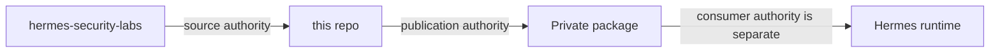

# Hermes Private Registry Publisher — documentation index

**Repository role:** private-package publication boundary.  
**Current repository visibility:** temporarily public under a documented implementation exception.  
**Final target:** private publisher repository + private package + separate runtime read-only consumer credential.

## Canonical documents

- [`publisher-boundary.md`](publisher-boundary.md) — trust and responsibility boundary.
- [`vampi-private-pilot.md`](vampi-private-pilot.md) — pilot details and acceptance history.
- [`../SECURITY.md`](../SECURITY.md) — security/reporting boundary.
- [`../README.md`](../README.md) — current state and operational sequence.

## Workflow evidence map

| Workflow | Purpose |
|---|---|
| `publish-private-vampi.yml` | Build/publish the reviewed private VAmPI package with supply-chain evidence. |
| `private-vampi-anonymous-deny.yml` | Prove anonymous access to the accepted private digest is denied. |
| `private-vampi-controlled-consumer-preflight.yml` | Preflight the separate consumer path. |
| `private-vampi-controlled-rollback-preflight.yml` | Preflight rollback semantics without conflating them with publication. |

## Responsibility split

Documentation must keep these evidence classes separate:

1. **source evidence** — what was built;
2. **publication evidence** — what immutable package/digest was produced;
3. **registry privacy/access evidence** — who can/cannot read the package;
4. **consumer evidence** — exact private pull under least privilege;
5. **deployment evidence** — runtime change/rollback/known state.

A publication `SUCCESS` proves only class 2 unless the workflow explicitly proves more.

## Maintenance rule

Always state repository visibility and package visibility independently. A public publisher repository during the temporary exception does not imply a public package, and the package must never be made public merely to simplify testing.
